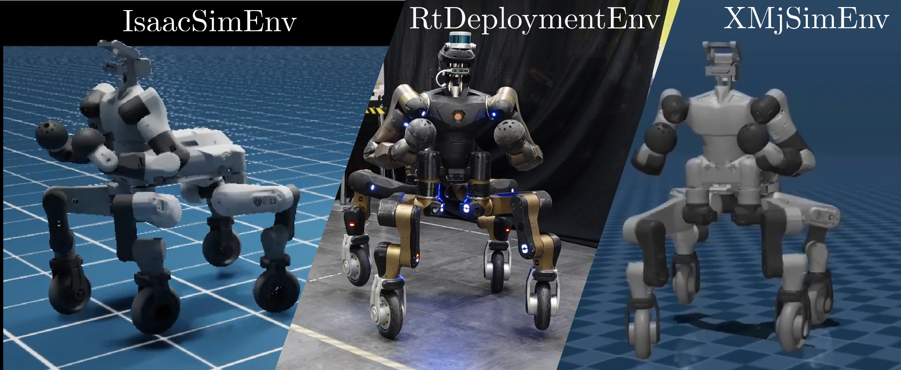

# AugMPCEnvs

World interfaces and training environment implementations for [AugMPC](https://github.com/AndrePatri/AugMPC).

## World interfaces
World interfaces are one of the three main AugMPC components (*world interface*, *MPC cluster*, *training environment*) and expose a common interface to query robot/MPCs/perception data. They coordinate with the training environment and the [MPC cluster](https://github.com/AndrePatri/MPCHive) via shared memory (see [EigenIPC](git@github.com:AndrePatri/EigenIPC.git)).

Available interfaces:
- `IsaacSimEnv`: main training and evaluation vectorized interface built on top of the Isaac Sim simulator (v4.2).
- `Isaac5xSimEnv`: WIP -- port of `IsaacSimEnv` for Isaac Sim 5.2.
- `XMjSimEnv`: non-vectorized MuJoCo interface on CPU via [xbot2_mujoco](https://github.com/AndrePatri/xbot2_mujoco) for sim-to-sim validation before hardware deployment.
- `RtDeploymentEnv`: real-time deployment through [xbot2](https://advrhumanoids.github.io/xbot2/master/index.html) and [adarl_ros](https://github.com/c-rizz/adarl_ros).

  

## Training environments
Training environment definitions live in `aug_mpc_envs/training_envs/`. Training environments essentially define the MDP for the task at hand (actions, observations, rewards, terminations, truncations) and use shared memory to communicate with the world interface. All environments inherit from [AugMPC](https://github.com/AndrePatri/AugMPC)'s `AugMPCTrainingEnvBase` class.

Available environments:
- `TwistTrackingEnv`: main task for tracking commanded base twists. The agent chooses contact schedules and twist commands for the underlying MPC controllers. A new flight phase is injected, for each leg, when the corresponding actions *instantaneously* exceed a given thresholds. Interestingly, this parametrization requires no clock in the observations.
- `FakePosTrackingEnv`: built on top of `TwistTrackingEnv`, it samples planar position targets and converts them into twist references for goal seeking. The agent it's still tracking twist references (that's why it's a "fake" position), but compared to `TwistTrackingEnv` provides more informative experience for training:

  

- `FlightPhaseControl`: extends `TwistTrackingEnv` exposing additional agent actions allowing it to also specify flight phases properties (length, apex, end). More control over flights becomes necessary when moving from flat terrain to more complex ones:

  

- `PhaseParametrizationEnv`: built on top of `TwistTrackingEnv`, overrides the *instantaneous* contact actions in favour of a *phase* parametrization, allowing the agent to control per-leg gait frequency/phase offsets (and optionally flight properties).
- `FakePosTrackEnvPhaseControl`: built on top of `FlightPhaseControl`, adds waypoint tracking (as in `FakePosTrackingEnv`) on top of flight-parameter control.
- `FakePosEnvPhaseParam`: built on top of `PhaseParametrizationEnv`, additionally implements waypoint tracking (as in `FakePosTrackingEnv`).

## Installation

The preferred way to install AugMPCEnvs is through [IBRIDO](https://github.com/AndrePatri/IBRIDO)'s container, which ships with all necessary dependencies. To setup the container, follow the instructions at [ibrido-containers](https://github.com/AndrePatri/ibrido-containers).
